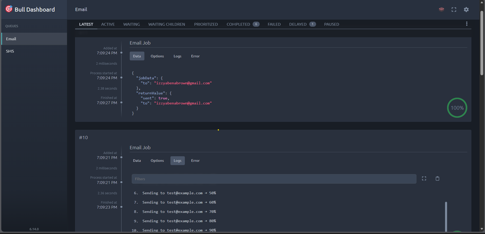
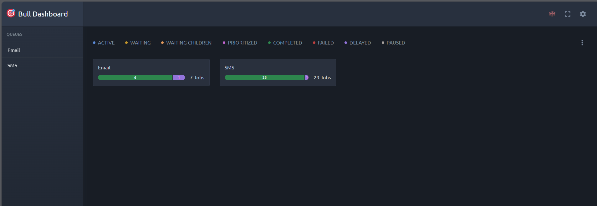
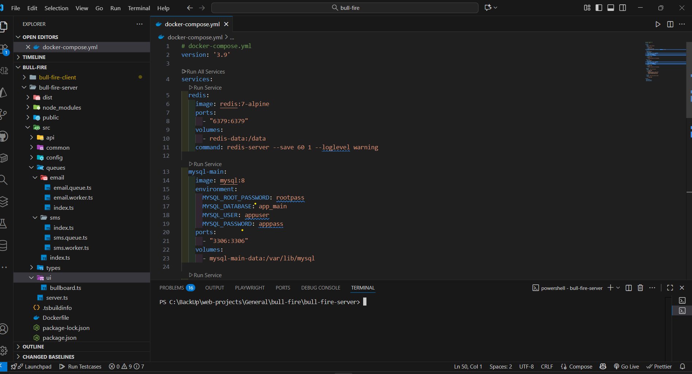
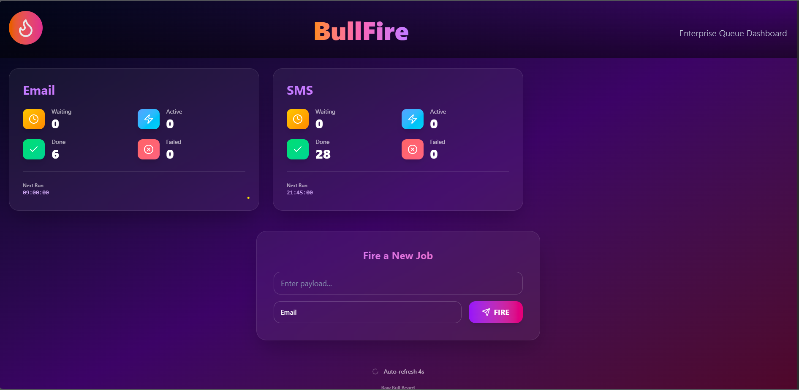

## BullFire — BullMQ background-job starter (React + Vite)

BullFire is a compact starter repository that demonstrates how to build background job processing using BullMQ (Redis) with a TypeScript/Express backend and a React + Vite frontend. It includes example queues (email, sms), a Bull Board dashboard, and a Docker Compose setup to run everything locally.

Highlights

- Full-stack example: backend (Express + BullMQ) + frontend (Vite + React)
- Example queues and workers (email, sms)
- Bull Board dashboard auto-detects queues and shows job details
- Docker Compose for quick local setup (Redis + backend + frontend)

Live (after `docker-compose up -d`)

- App: http://localhost:5000
- Dashboard: http://localhost:5000/ui

## Table of contents

- [Quick start (Docker)](#quick-start-docker)
- [Local development](#local-development)
- [API examples](#api-examples)
- [Screenshots](#screenshots)
- [Project structure](#project-structure)
- [Contributing](#contributing)
- [License](#license)

## Quick start (Docker)

1. Clone the repo

```powershell
git clone <your-repo-url>
cd bull-fire
docker-compose up -d
```

2. Open the app and dashboard in your browser:

- App: http://localhost:5000
- Dashboard: http://localhost:5000/ui

## Local development

Notes: the following commands were taken from the project's `package.json` files.

Backend (development)

```powershell
cd bull-fire-server
npm install
npm run dev
```

This runs the server with `ts-node` (see `bull-fire-server/package.json`). By default the server is configured to serve the dashboard at `/ui`.

Frontend (development)

```powershell
cd bull-fire-client
npm install
npm run dev
```

This starts Vite's dev server (see `bull-fire-client/package.json`).

Build and preview

Frontend build:

```powershell
cd bull-fire-client
npm run build
npm run preview
```

Backend build + start:

```powershell
cd bull-fire-server
npm run build
npm start
```

## API examples

- Enqueue a job (example):

```powershell
curl "http://localhost:5000/api/jobs/add?queue=Email&to=dev@team.com"
```

- Queue stats:

`GET /api/queue/stats` — aggregated stats for all queues.

For the full list of routes, check `bull-fire-server/src/api/routers`.

## Screenshots

Below are screenshots from the repository's `screenshots/` directory. Each thumbnail links to the full-size image. If your Markdown viewer doesn't show images, open the `screenshots/` folder in your file manager or use VS Code's preview.

<div style="display:flex;gap:12px;flex-wrap:wrap">
  <a href="./screenshots/bull-board-details.png">
  </a>
  
  <a href="./screenshots/bull-board-overview.png">
  </a>
  <a href="./screenshots/docker-compose.png">
  </a>

  <a href="./screenshots/bullfire-react.png">
  </a>
</div>

If your local filenames are different, or you'd prefer shorter/cleaner names (recommended), I can rename the files (e.g. `dashboard.png`, `queue-details.png`, `jobs.png`, `add-job.png`) and update this README accordingly. Renaming is optional but improves readability and prevents URL-encoding issues.

## Project structure (high level)

```
bull-fire-server/       # backend (Express + BullMQ)
  src/
    queues/             # each queue has its own folder: .queue/.worker/index
    api/                # controllers, routers
    config/             # redis + db config

bull-fire-client/       # frontend (Vite + React)
  src/
    components/
    store/              # zustand store for queue state
```

## Contributing

Contributions welcome. Open an issue or a PR with a clear description. If you add a queue, include tests for the worker behavior when possible.

Small suggestions I can help with next:

- Rename and compress screenshots and commit them into `docs/` or `screenshots/` with cleaner filenames.
- Add `.env.example` with the minimal environment variables for local development.
- Create a short architecture diagram.

## License

MIT

---